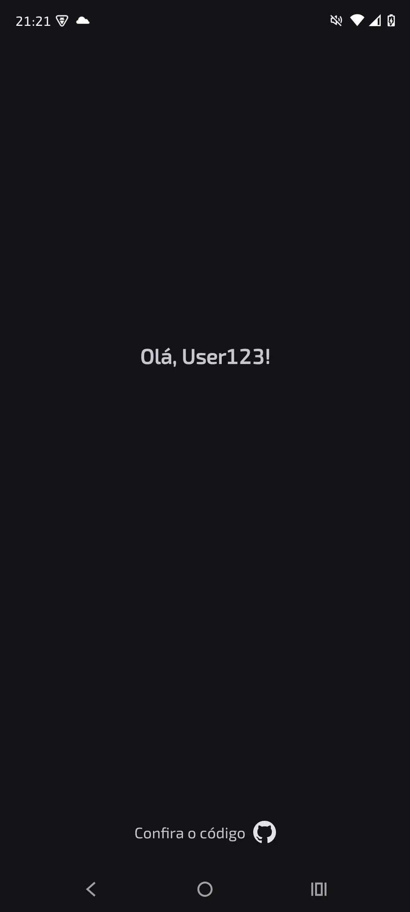
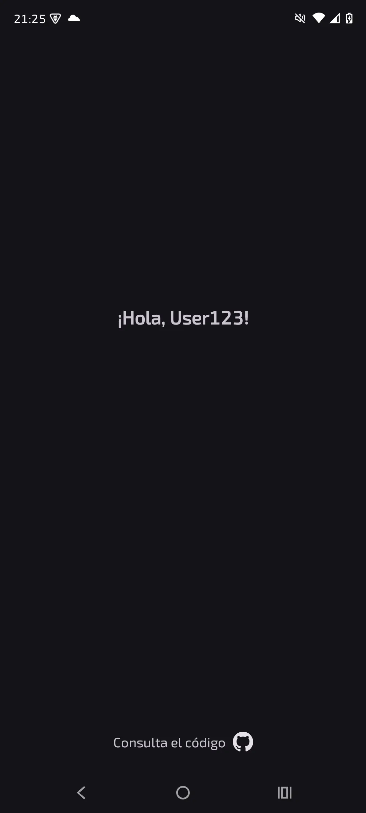
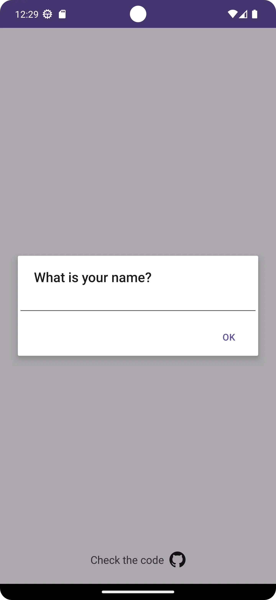
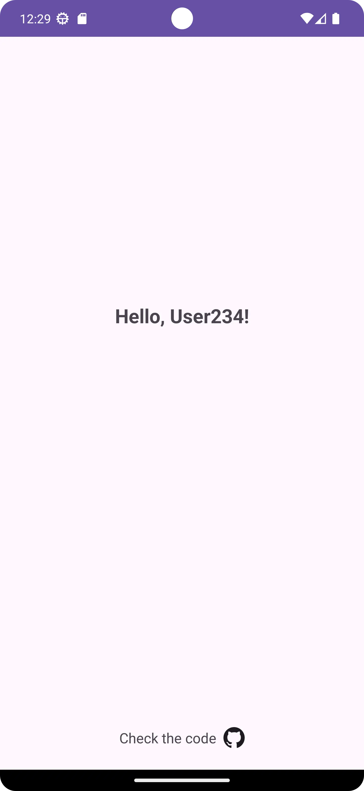

# Criando um App Android com Suporte a Vários Idiomas

## Descrição

Este é um projeto para praticar internacionalização (suporte de diferentes idiomas) em um aplicativo Android.

Ao ser iniciado, o app mostra uma caixa de diálogo perguntando o nome do usuário e, em seguida, 
exibe a mensagem correspondente nos idiomas implementados: inglês (padrão), português e espanhol.

## Telas

  ### Português
  
  

  ---

  ### Espanhol
  
  
  O diálogo inicial segue o mesmo padrão das outras linguagens, mas em espanhol.
  
  ---
  
  ### Inglês
  
  

